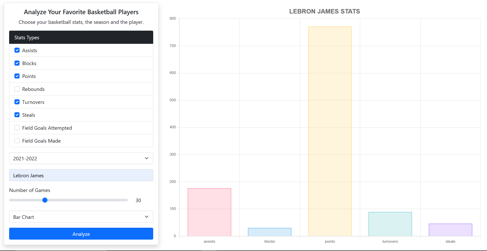
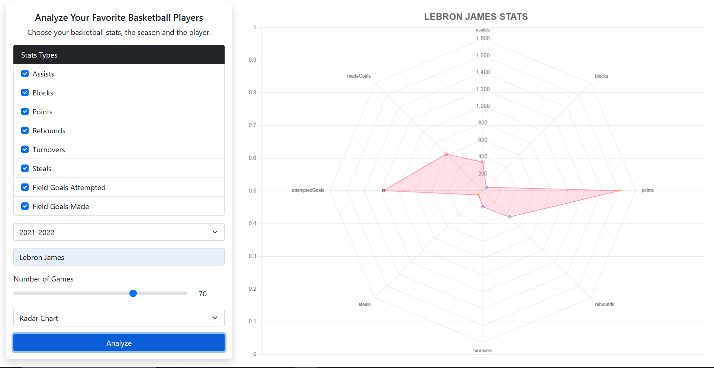
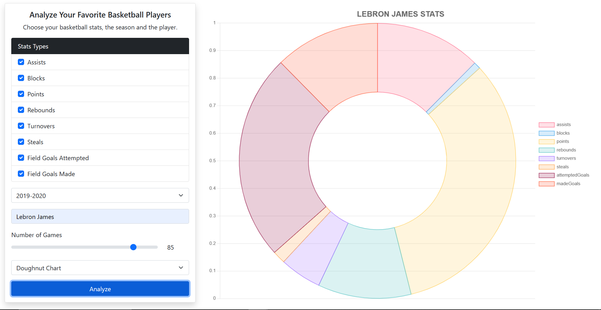

# Basketball Stats Analyzer

Basketball Statistics Analyzer is a user-friendly application designed to help basketball enthusiasts, analysts, and coaches explore and visualize a wide range of basketball statistics. The application allows users to select from various key statistics, such as assists, blocks, points, rebounds, turnovers, steals, field goals attempted, and field goals made.

With the ability to choose data from a specific season and customize the number of games for analysis, users can tailor their insights to focus on relevant trends and patterns. To better comprehend the selected data, the application offers three distinct chart types: bar chart, radar chart, and doughnut chart, each providing a unique perspective on the performance of players, teams, and overall trends within the chosen parameters.

## UI

### Bar Chart

### Radar Chart

### Doughnut Chart

